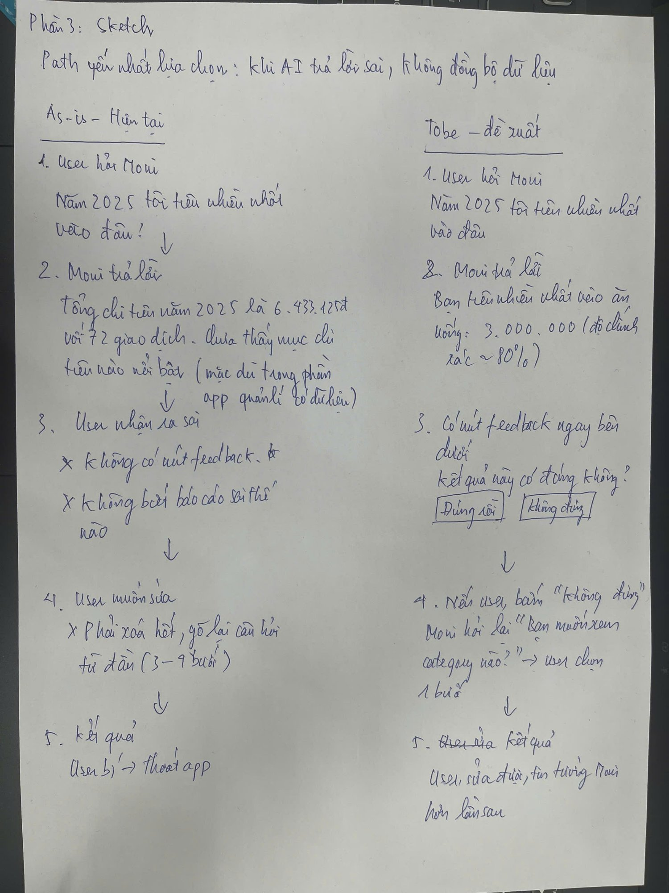

# UX Analysis — MoMo · Trợ thủ AI Moni

## Sản phẩm
MoMo — Trợ thủ AI Moni  
Feature: Phân loại chi tiêu, chatbot tư vấn tài chính cá nhân

---

## Phần 1 — Marketing hứa gì

MoMo quảng cáo Moni là "trợ thủ tài chính AI" với 4 cam kết:
- Quản lý tiền thành thói quen
- Đầu tư tiền đơn giản hơn
- Tiếp cận tín dụng dễ dàng hơn
- Vận hành kinh doanh trơn tru

Định vị: "Trợ thủ đắc lực, cánh tay phải" — ngụ ý AI hiểu và cá nhân hóa theo từng user.

---

## Phần 2 — Phân tích 4 paths

### Path 1 ✅ Khi AI đúng
- User thấy: kết quả hiển thị đầy đủ, rõ ràng
- App confirm: UI đẹp, animation mượt, breakdown từng category chi tiết
- Đánh giá: đây là path được đầu tư nhất — luồng happy path hoàn chỉnh

### Path 2 ❓ Khi AI không chắc
- Moni hỏi lại user muốn gì
- Liệt kê các lựa chọn để user chọn tiếp
- Đánh giá: xử lý tương đối ổn, có cơ chế clarification cơ bản

### Path 3 ❌ Khi AI sai
- User biết sai bằng cách: tự phát hiện (app không tự báo)
- Ví dụ thực tế: Moni có thống kê chi tiêu nhưng không chỉ ra được mục chi tiêu nhiều nhất khi hỏi trực tiếp
- Cách sửa: không có nút feedback, phải thoát ra ngoài rồi hỏi lại từ đầu
- Số bước để sửa: 3–9 bước
- Đánh giá: PATH YẾU NHẤT — không có cơ chế correction nào

### Path 4 🚪 Khi user mất tin
- Fallback người thật: không tìm thấy
- Thoát được không: có thể thoát app, nhưng không có lối thoát sang kênh khác
- Không có nút "Chat với nhân viên" hay hotline trong luồng AI
- Đánh giá: yếu — user bị kẹt hoàn toàn khi mất tin vào Moni

---

**Path tốt nhất: Path 1 — Khi AI đúng**  
Vì UI được đầu tư nhất: animation mượt, kết quả breakdown rõ ràng theo category, user không cần hỏi thêm.

**Path yếu nhất: Path 3 + Path 4**  
Path 3: Moni trả lời sai, hỏi lại vẫn không trả lời được, không có nút báo sai, phải thoát ra để hỏi tiếp.  
Path 4: Không có bất kỳ cơ chế nào để liên hệ người thật khi user mất tin hoàn toàn.

---

**Gap marketing vs thực tế**

| | Nội dung |
|---|---|
| Marketing hứa | "Cá nhân hóa với từng user" |
| Thực tế | Gợi ý giống nhau cho mọi user, không thay đổi dù dùng lâu |
| Gap | "Cá nhân hóa" chưa thực sự xảy ra — AI chưa học từ lịch sử của từng user |

| | Nội dung |
|---|---|
| Marketing hứa | "Trợ thủ đắc lực" quản lý chi tiêu |
| Thực tế | Có thống kê chi tiêu nhưng không trả lời được câu hỏi cơ bản: "Tôi tiêu nhiều nhất vào đâu?" |
| Gap | Feature thống kê tồn tại nhưng AI không khai thác được để trả lời insight đơn giản |

---

## Phần 3 — Sketch as-is and to-be

**Path được chọn để cải thiện: Path 3 — Khi AI sai**  
Tình huống cụ thể: Moni trả lời sai + không đồng bộ dữ liệu

**Giải thích sketch:**

| As-is (hiện tại) | To-be (đề xuất) |
|---|---|
| User hỏi "Năm 2025 tôi tiêu nhiều nhất vào đâu?" | User hỏi câu hỏi tương tự |
| Moni trả lời tổng chi tiêu 6.433.125đ với 72 giao dịch — nhưng không chỉ ra mục nổi bật | Moni trả lời rõ: "Ăn uống: 3.000.000đ" + hiển thị độ chính xác ~80% |
| User nhận ra sai — không có nút feedback, không biết báo cáo sai thế nào | Có nút feedback ngay bên dưới: "Đúng rồi / Không đúng" |
| Muốn sửa phải xóa hết, gõ lại từ đầu (3–9 bước) | Nếu bấm "Không đúng" → Moni hỏi lại "Bạn muốn xem category nào?" → user chọn 1 bước |
| Kết quả: user bí → thoát app | Kết quả: user sửa được, tin tưởng Moni hơn lần sau |

---

*Bài tập UX — Ngày 5 — VinUni A20 — AI Thực Chiến · 2026*
